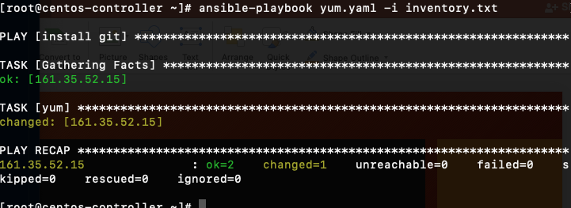
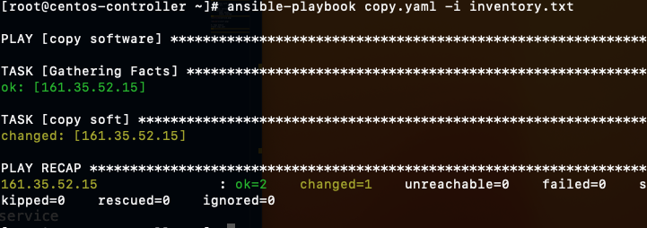
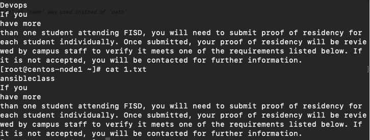

# Ansible Modules

## Package management

Module for most popular package managers, such as DNF and APT, to enable you to install any package on a system.

## Service

The service module enables to start, stop, reload installed packages.

## Copy

The copy module copies a file from the local or remote machine to a location on the remote machine.

## File

The file module manages the file and its properties

## Lineinfile

The lineinfile module manages lines in a text file.

shell module is designed to execute Shell commands against the target Unix based hosts.

Command
Executes a command on a remote node

Script
Runs a local script on a remote node after transferring it

Archive
The archive module creates a compressed archive of one or more files

1; Installing packages

```
Create yum.yaml file
---
 - name: install git
   hosts: all
   tasks:
    - name: yum
      yum:
       name: git
       state: latest
# Run the ansible-playbook yum.yaml -i inventory.txt 
```

We can see that, git installed to node1 machine




2; Service module
Create service.yaml

```
---
 - name: deal with service
   hosts: all
   tasks:
    - name: service start
      service:
         name: docker
         state: started
```


3; Copy module
Create copy.yaml

```
---
 - name: copy software
   hosts: all
   tasks: 
    - name: copy soft
      copy:
       src: /root/prometheus-2.37.6.linux-amd64.tar.gz
       dest: /root/
# Run the ansible-playbook copy.yaml -i inventory.txt command
```




4; Install yum package

```
---
- name: install some packages
  hosts: all
  tasks:
   - name: yummodule
     yum:
       name: httpd
       state: latest
```

```
httpd -version
Server version: Apache/2.4.6 (CentOS)
Server built:   Apr  5 2023 17:18:30
```


5; Using lineinline:

```
---
- name: Modify files
  hosts: all
  tasks: 
   - name: change some lines
     lineinfile:
        path: /root/1.txt
        regexp: '^Devops'
        insertafter: 'Devops'
        line: 'ansibleclass'
        backup: yes
```

It will replace Devops to ansibleclass



```
---
- name: Modify files
  hosts: all
  tasks: 
   - name: change somelines
     lineinfile:
        path: /root/1.txt
        #regexp: '^Devops'
        insertafter: 'EOF'
        line: 'END OF TEXT FILE'
        backup: yes
```

```
[root@centos-node1 ~]# cat 1.txt
ansibleclass
If you 
have more 
than one student attending FISD, you will need to submit proof of residency for each student individually. Once submitted, your proof of residency will be reviewed by campus staff to verify it meets one of the requirements listed below. If it is not accepted, you will be contacted for further information. 
END OF TEXT FILE
```

It added the END OF TEXT FILE line at the end.

## Register, Debug and Shell in ansible

Can create variables from the output of an Ansible task with the task keyword register. can use registered variables in any later tasks in your play. 

Debug: this module prints statements during execution and can be useful for debugging variables or expressions without necessarily halting the playbook. Useful for debugging together with the when directive.

Shell: designed to execute shell commands against target Unix based hosts. Unlike the Ansible command module, ansible Shell would accept any highly complexed commands with pipes, redirection etc.

6; Create yaml file, using shell command, with date command, output of this shell module will store in out variable, can give other name, you should get the date of the target system.

```
---
- name: check date of target system
  hosts: all
  tasks:
    - name: register date and check
      shell: date
      register: out

    - name: debug messages
      debug:
        var: out

# Result
ok: [161.35.52.15] => {
    "out": {
        "changed": true, 
        "cmd": "date", 
        "delta": "0:00:00.003913", 
        "end": "2023-04-09 18:58:25.461340", 
        "failed": false, 
        "rc": 0, 
        "start": "2023-04-09 18:58:25.457427", 
        "stderr": "", 
        "stderr_lines": [], 
        "stdout": "Sun Apr  9 18:58:25 UTC 2023", 
        "stdout_lines": [
            "Sun Apr  9 18:58:25 UTC 2023"
        ]
    }
}
```
Using multiple shell commands:

```
---
- name: check date of target system
  hosts: all
  tasks:
    - name: register date and check
      shell: |
        date
        hostname -f
        uptime
      register: out

    - name: debug messages
      debug:
        var: out

ok: [161.35.52.15] => {
    "out": {
        "changed": true, 
        "cmd": "date\nhostname -f\nuptime\n", 
        "delta": "0:00:00.009447", 
        "end": "2023-04-09 19:08:14.519152", 
        "failed": false, 
        "rc": 0, 
        "start": "2023-04-09 19:08:14.509705", 
        "stderr": "", 
        "stderr_lines": [], 
        "stdout": "Sun Apr  9 19:08:14 UTC 2023\ncentos-node1\n 19:08:14 up 2 days, 15:13,  2 users,  load average: 0.00, 0.01, 0.05", 
        "stdout_lines": [
            "Sun Apr  9 19:08:14 UTC 2023", 
            "centos-node1", 
            " 19:08:14 up 2 days, 15:13,  2 users,  load average: 0.00, 0.01, 0.05"
        ]
    }
}
```

