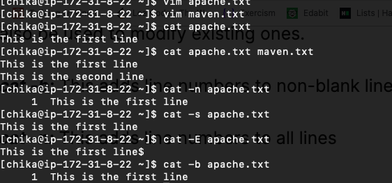
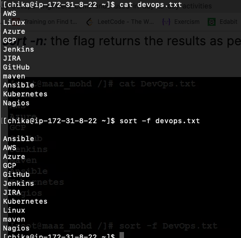
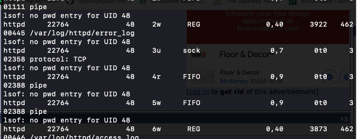
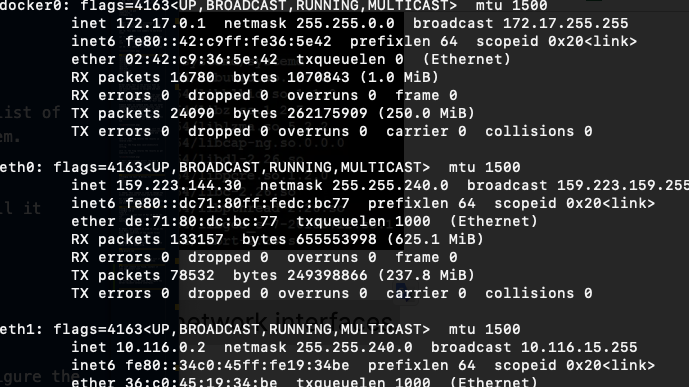

# Basic commands for Linux

1; Sudo : This command executes only that command with superuser privileges.


2; Pwd: This command will print your directory location, where you currently working.

```
[chika@ip ~]$ pwd
/home/chika
[chika@ip ~]$ 

```

3; Cat: This is used to concatenate and display files on the terminal. It can also be used to modify existing ones.

cat -b: This adds line numbers to non-blank lines

cat -n: This adds line numbers to all lines

cat -s: This squeezes blank lines into one line

cat –E: This shows $ at the end of the line



```
[chika@ip ~]$ cat /etc/shells
/bin/sh
/bin/bash
/usr/bin/sh
/usr/bin/bash
/bin/csh
/bin/tcsh
/usr/bin/csh
/usr/bin/tcsh

```

Mostly used modes in VIM:

Normal mode: This is the default mode in which vim starts. In normal mode, you can use various commands to navigate and edit the text.

Insert mode: In insert mode, you can type text into the file. To enter insert mode, press the "i" key. To exit insert mode and return to normal mode, press the "Esc" key.

Command mode: In command mode, you can enter commands to perform various actions, such as saving the file or quitting vim. To enter command mode, press the ":" key.

4; Grep: This command searches for a particular string/ word in a text file. This is similar to “Ctrl+F” but executed via a CLI.


5; Sort: This command is used to sort the results of the search either alphabetically or numerically. It also sorts files and directories.

sort -r: the flag returns the results in reverse order.

sort -f: the flag does case-insensitive sorting.

sort -n: the flag returns the results as per numerical order.



6; Tail: This command prints the last N number of data of the given input. By default, it prints 10 lines.

We can specify the number of lines, that we want to display.

```
[chika@ip ~]$ tail -5 devops.txt 
maven
Ansible
Kubernetes
Nagios

```

7; Chmod: This command is used to change the access permissions of files and directories.

For example: Following the chmod command will give the user permission to read, write and execute a file.

```
[root@ip ~]# chmod u+rwx apache/
[root@ip ~]# ll
total 8
-rwxr--r--. 2 root root 17 Mar 18 04:44 abc.txt
drwxr-xr-x. 2 root root  6 Mar 18 06:05 apache

```

8; Chown: This command is used to change the file Owner or group.
Below, the ownership of the apache folder change to naza


9; Ping – This command will ping a host and check if it is responding.

```
ping google.com

```

10; lsof: It is used to display a list of all the open files on a Linux system.

```
# If lsof command not found, install it
sudo yum install lsof
lsof
```



11; Ifconfig: This is used to configure the kernel-resident network interfaces.



12; ID: This is used to find out user and group names and numeric IDs (UID or group ID) of the current user or any other user in the server.
Syntax: id <option> <user_name>

13; Cut: This command is used to extract specific fields or columns from a file or standard input.

It is often combined with other commands, such as sort, uniq, and grep, to perform more complex text-processing tasks.


14; Sed: This is used to perform basic text transformations on an input file. It stands for "stream editor" and is a powerful tool for editing text files or streams in a Linux environment.


15; Redirecting the commands

```
dat >> dateFile 2>&1
# 2>&1 - if it's the error or the standard output pls redirect to this file
[root@docker ~]# dat >> dateFile 2>&1
[root@docker ~]# cat dateFile
-bash: dat: command not found
# O -SUCCESS; 2-STDERROR; 1-STDOUT
```

All commands all have the output, we have our the standard output, if something wrong, it gonna show us the error output.


